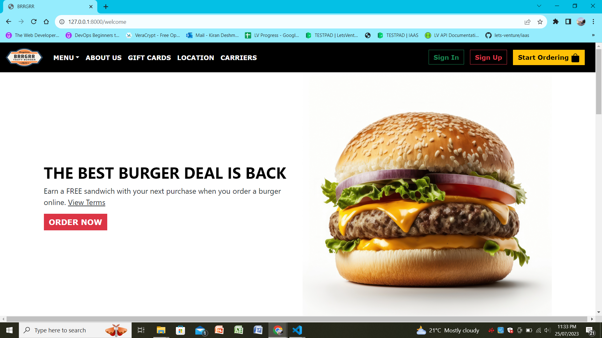
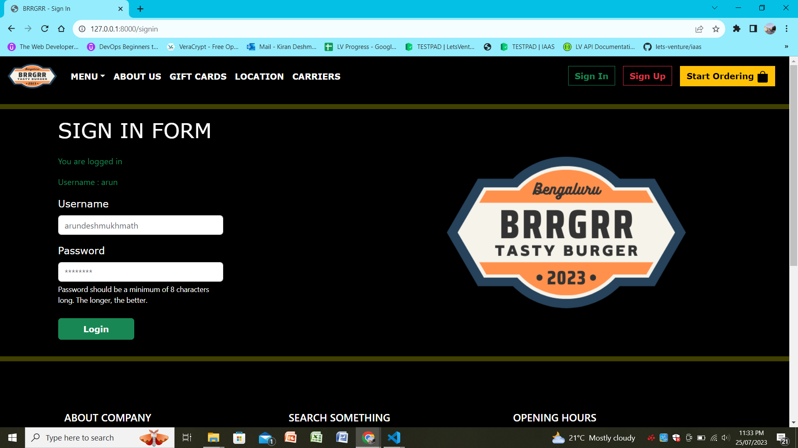
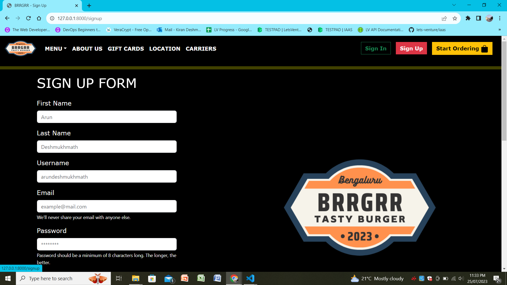
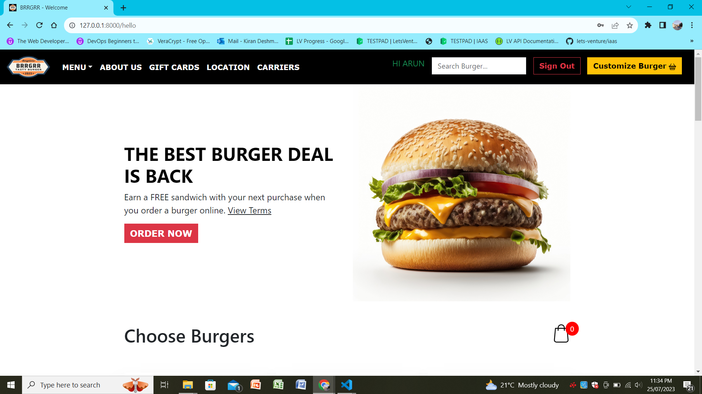
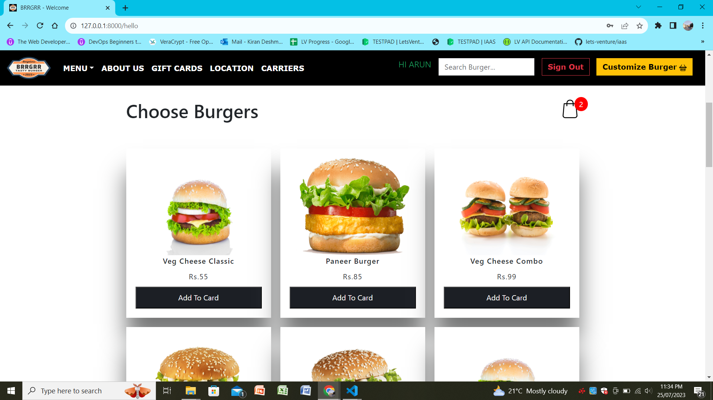
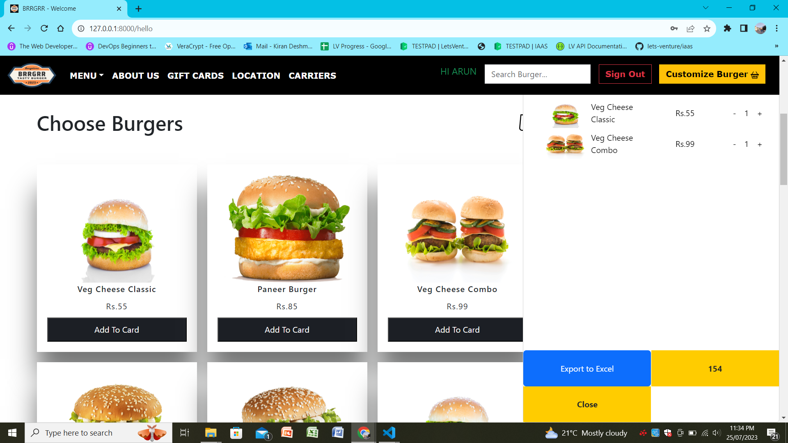
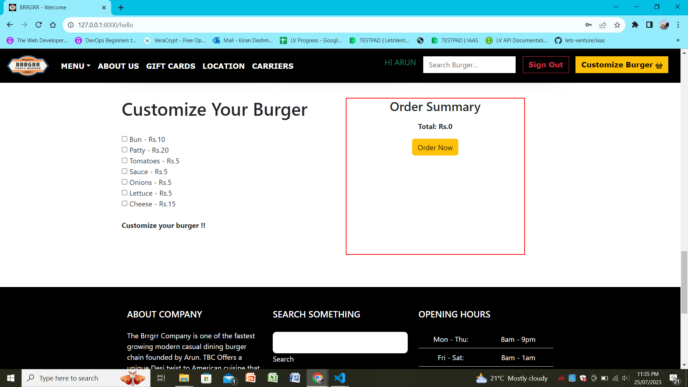

# Burger shop Website (BRRGRR)

Brrgrr is a full-stack website for a burger shop developed using HTML, CSS, JavaScript, Bootstrap, Django, and SQLite3. The website offers a seamless user experience with features like user registration, sign-in, and personalized home page navigation displaying the user's name. The menu presents a variety of delicious burgers, allowing users to add items to their cart with ease. Additionally, users can enjoy the customization option to create their own burgers, and pricing will be dynamically adjusted accordingly.

## Key Features:

User Registration and Sign-In:
Users can create accounts by registering themselves on the website. After registration, they can sign in securely using their credentials.

### Personalized Home Page:
Upon successful sign-in, users are directed to a personalized home page. The navigation bar displays their name, providing a warm welcome.

### Extensive Burger Menu:
The menu showcases an array of mouthwatering burgers with enticing images and detailed descriptions. Users can explore various options and ingredients.

### Add to Cart:
Users can easily add their favorite burgers to the cart with a simple click. The cart feature keeps track of selected items and dynamically updates the total price.

### Customization Option:
For those craving a unique taste, the website offers a customization feature. Users can design their own burgers by selecting ingredients and toppings.

### Dynamic Pricing:
The pricing for customized burgers is dynamically calculated based on the selected ingredients, ensuring accuracy and transparency.

### Export to Excel:
For convenience, users can download an Excel sheet containing the items in their cart. This feature is useful for keeping records or sharing orders.

## Technologies Used:

**Frontend**: HTML, CSS, JavaScript, Bootstrap
**Backend**: Django (Python), SQLite3 (database)
**Data Manipulation**: Pandas (for exporting cart items to Excel)

## Conclusion:

Brrgrr is a delightful burger shop website that ensures a smooth user experience from registration to creating customized orders. With an extensive menu, straightforward cart system, and the convenience of exporting cart items to Excel, it promises to satisfy the cravings of all burger enthusiasts.


## Steps to run the server
- Clone the repository
- Go to your IDE terminal and **cd** to the directory
- Go to the directory where you should be able to see manage.py file after executing **ls** command
- Now type the following command on the command prompt
```
python manage.py runserver
```
- Now you will see a localhost link as shown below

```
PS C:\Users\User\Desktop\burgerwithcart\New folder\brrgrr> python .\manage.py runserver
Watching for file changes with StatReloader
Performing system checks...

System check identified no issues (0 silenced).
July 25, 2023 - 23:33:40
Django version 4.2.3, using settings 'brrgrr.settings'
Starting development server at http://127.0.0.1:8000/
Quit the server with CTRL-BREAK.
```
- You just have to click on **http://127.0.0.1:8000/**. You will be lead to website.


## Welcome Page


## Sign In Page


## Sign Up Page


## Home Page (After Signing In)


## Menu (After Signing In)


## Cart (After Signing In)


## Customization of Burger (After Signing In)

